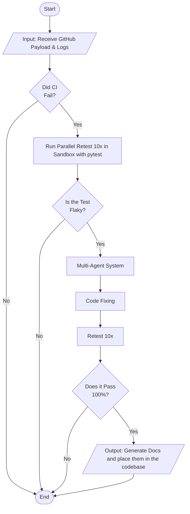

# Flaky Debug Agent

A CI/CD automation system that debugs flaky-based deployments. 
External system that relies on Github Actions. 
The goal of the system is to determine if the failure is a flaky-based error. 
If it is not then call Bob for fixing instantly. 
Else run through check test for possible root causes in the Git Diffs then Modularity of the feature.
Supports: Python, Ruby, Go, .Net, JS/TS, Jest, Maven Surefire

## Flow (Mermaid)

## GitHub integration

The backend reaches a user's CI either through a **GitHub App** (`services/github_app.py`) — one App installed on any number of repos, each webhook delivery carrying an `installation.id` that's exchanged for a short-lived installation token — or, as a fallback, a **personal access token** (`GITHUB_TOKEN`) plus a **repo webhook**. The App is preferred whenever `GITHUB_APP_ID` is set; the PAT is used for calls with no installation context (the JUnit ingest endpoint) or when no App is configured at all.

| Endpoint | Called by | Purpose |
|---|---|---|
| `POST /api/webhooks/github` | Repo webhook (`workflow_run` events) | Starts the flaky rerun, then the analysis once the rerun is done |
| `POST /api/webhooks/junit` | You / other CI systems | Hand in JUnit XML directly, skipping the GitHub rerun |

Both endpoints require an `X-Hub-Signature-256` HMAC of the body, keyed with `GITHUB_WEBHOOK_SECRET`, and reply `202` with `{action, reason, thread_id}`. The actual work runs in the background, because it takes far longer than GitHub's 10-second webhook timeout.

**Flow**
1. **Phase A.** A workflow listed in `WATCHED_WORKFLOWS` fails. The backend reads that run's JUnit artifact to find the failing tests. It then dispatches **Flaky Rerun** with `purpose=detect` on the default branch, for the failing commit.
2. Flaky Rerun runs those tests `RERUN_ATTEMPTS` times (default 5) in parallel, each on a fresh VM, and uploads `rerun-attempt-<n>` artifacts.
3. **Phase B.** When the detect rerun completes, the backend downloads its artifacts, plus the original run's JUnit report as attempt 0. It turns them into per-test pass/fail counts (`rerun_results`) and runs the LangGraph graph with `thread_id` = the original run id. The monitoring dashboard shows the result.
4. **Retest.** The graph's `retest_flaky` node dispatches Flaky Rerun again with `purpose=retest` to verify the fix, and waits for the result itself. The webhook ignores retest runs, so they can't start a new analysis.

### Deployment and demo
- **[`deploy/`](deploy/README.md)** runs the whole stack on one machine with Docker Compose: API, graph, IBM Bob, Postgres and dashboard, published at a stable URL through ngrok. Its runbook covers the setup below end to end.
- **[`examples/flaky-demo/`](examples/flaky-demo/README.md)** is the watched repo for the demo: a small service with a genuinely flaky async test, a `deploy.yml` pipeline (test, then deploy) and `flaky-rerun.yml`. Push it as its own public GitHub repo.
