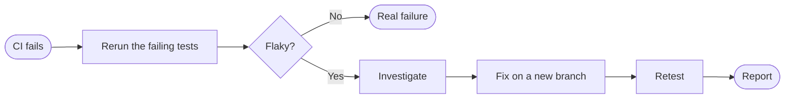

# Flaky Debug Agent

Flaky Debug Agent watches your GitHub Actions pipeline and finds out whether a failing test is **flaky** (it fails only sometimes) or a **real failure**. For flaky tests, IBM Bob investigates the cause, proposes a fix on a separate branch, checks that the fix works, and writes a report. You follow everything on a web dashboard.

## What it does

1. **Detects:** notices when a watched CI workflow fails, and which tests failed.
2. **Reruns:** runs only those tests several times in parallel, each time on a fresh machine.
3. **Classifies:** a test that both passed and failed is flaky. One that fails every time is a real failure.
4. **Investigates:** IBM Bob looks at recent changes and the test code to find the likely cause, such as a race condition or tests that depend on each other's order.
5. **Fixes:** Bob applies a small fix and pushes it to a new `flaky-fix/…` branch. Your main branch is never touched.
6. **Retests:** the fix branch is rerun the same way to confirm the test is no longer flaky.
7. **Reports:** Bob writes a short report with the findings, the fix and recommendations.

```mermaid
flowchart LR
    A(["CI fails"]) --> B["Rerun the failing tests"]
    B --> C{"Flaky?"}
    C -- No --> D(["Real failure"])
    C -- Yes --> E["Investigate"]
    E --> F["Fix on a new branch"]
    F --> G["Retest"]
    G --> H(["Report"])
```

Works with pytest, Jest, Vitest, Go, Maven, RSpec and .NET test suites.

## How to use it

### 1. Connect your repository
Ask whoever runs the agent to add your repository. The repository needs three things:
- The agent's GitHub App installed on it.
- The `flaky-rerun.yml` workflow (from [`backend/templates/`](backend/templates/flaky-rerun.yml)) on the default branch.
- A CI workflow that saves its test report (JUnit XML) when it fails.

### 2. Work as usual
Push code as you normally do. When a watched workflow fails, the agent starts by itself. On GitHub's **Actions** tab you'll see a **Flaky Rerun** run appear shortly after the failure.

### 3. Check the Runs page
Open the dashboard and go to **Runs**. Each failed CI run gets a row, and the page updates by itself:

| Status | Meaning |
|---|---|
| Running | The agent is still analysing the failure. |
| Flaky · in progress | The test is flaky; the investigation, fix or retest is still running. |
| Resolved | The test was flaky, and the fix passed the retest. |
| Retest failed | The test was flaky, but the fix didn't pass the retest. |
| Real failure | The test fails every time. This is a genuine bug, and the agent doesn't try to fix it. |

### 4. Open a run
Click a row to see the details:
- **Failing tests:** how many attempts each test passed.
- **Classification, Code fix, Retest:** the agent's verdict at each stage.
- **Report:** Bob's write-up of the cause, the fix and recommendations.
- **Node timeline:** each step the agent took, in order.

### 5. Review the fix
If a run shows **Resolved**, look at the `flaky-fix/…` branch in your repository. If you agree with the change, open a pull request and merge it. Nothing is ever merged automatically.

If the retest failed, or no fix was made, use the report's findings to fix the test yourself.

### 6. Try the Live Demo
Open **Live Demo** in the dashboard and press **Run Deploy**. It starts the demo project's pipeline, which has a test that fails about half the time, and shows the jobs and logs live. If the run fails, the agent picks it up and it appears on the **Runs** page. If it passes, press **Run again**.

## Good to know
- **Nothing is merged for you.** Fixes only land on separate `flaky-fix/…` branches.
- **Real failures are only reported**, never fixed.
- **Anyone with the dashboard link can see the runs and reports**, so share it with care.

Setting up or running the agent yourself? See [`deploy/README.md`](deploy/README.md).
